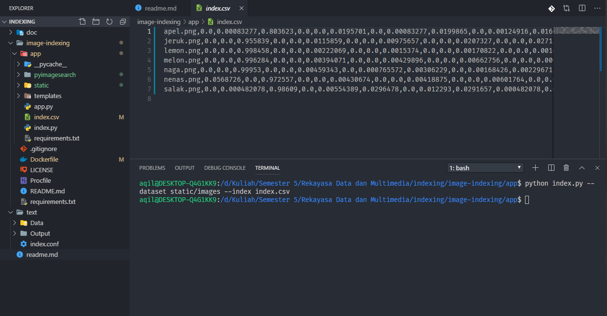

# TEXT AND IMAGE INDEXING

## 1. Text-Indexing :

### Run Program :
- `cd ./text`
- `swish-e -c index.conf`

- `cd ./output`
- `run swish-e -w '{word}'` to see the results of your indexing 

### Requirement :
- SWISH-E :
  run on your linux terminal -> `sudo apt-get install swish-e`

### Optional :
  You can change as you like to get the desired results on index.conf. for more detail check https://www.esa.org/tiee/search/html/swish-config.html

## 2. Image-Indexing :

### Run Program :
- `cd ./image-indexing`
- `pip install -r requirements.txt`
- `cd ./app`
- `python index.py --dataset static/images --index index.csv`
- see output on index.csv

### Optional :
  You can set all image you want to index on ./static/images if you want to change image

### requirement :
- PIP :
  run on your linux terminal -> `sudo apt install python3-pip`
  
# Sources :

1. Text-Indexing : [Swish-e](https://www.esa.org/tiee/search/html/install.html) (Install Package on Ubuntu)
2. Image-Indexing : [image-search-engine](https://github.com/kudeh/image-search-engine)
